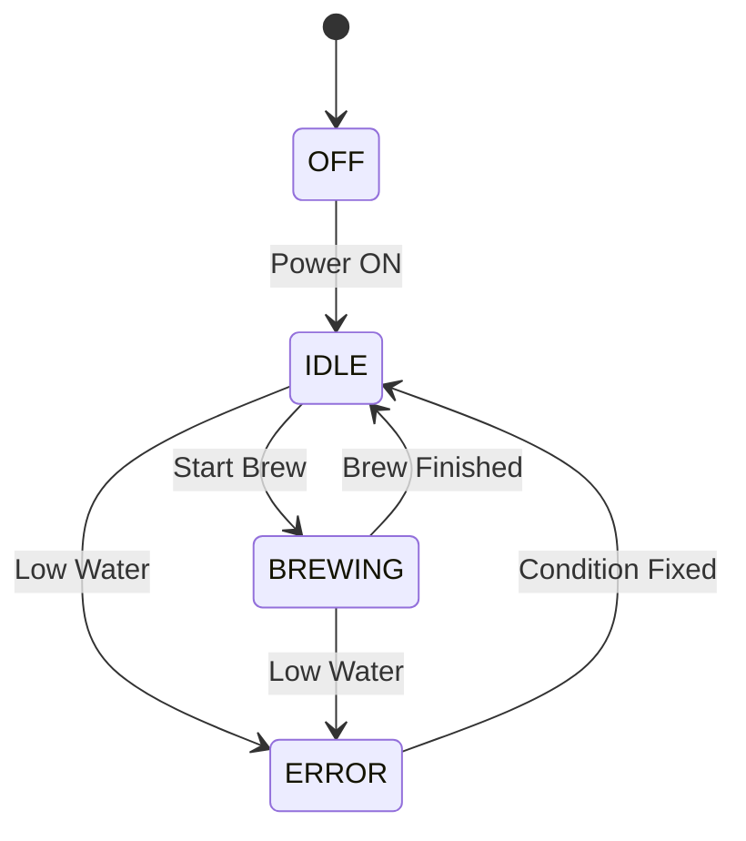

# ☕ FreeRTOS Coffee Machine — Full Documentation

## Badges


---

An Embedded Coffee Machine Simulation Using STM32 + FreeRTOS + ST7735 TFT

This project implements a fully functional coffee-machine simulation running on an STM32 microcontroller using FreeRTOS, HAL drivers, and an ST7735 TFT display.
It demonstrates multitasking, event groups, hardware abstraction, debouncing, state-machine design, and real-time scheduling.

## 🧩 State Machine Diagram (Mermaid)



## 🔌 Pinout Summary

A complete pinout table is in the repository, but here are the main groups:

| Function     | Macro Name               | MCU Pin | Type / Notes |
| ------------ | ------------------------ | ------- | ------------ |
| Power Button | `BUTTON_EXTI13_Pin`      | PC13    | EXTI input   |
| Cup Size 1   | `BUTTON_CUP_SIZE_1_Pin`  | PC0     | EXTI input   |
| Cup Size 2   | `BUTTON_CUP_SIZE_2_Pin`  | PC1     | EXTI input   |
| Cup Size 3   | `BUTTON_CUP_SIZE_3_Pin`  | PC2     | EXTI input   |
| Cup Size 4   | `BUTTON_CUP_SIZE_4_Pin`  | PC3     | EXTI input   |
| Strong Brew  | `BUTTON_STRONG_BREW_Pin` | PC4     | EXTI input   |


## 🛠️ Requirements

STM32L4 or equivalent STM32 board

STM32CubeIDE (recommended)

FreeRTOS (bundled with CubeIDE)

ST7735 TFT Display

Basic buttons, buzzer, LEDs, and analog sensor

## 🚀 Getting Started
1. Clone the repository
git clone https://github.com/LucasIvankio/FreeRTOS_CoffeeMachine.git

2. Open with CubeIDE

File → Open Project from File System

Select the project root

3. Build and flash

Click Build → Run/Debug.

4. Connect UART
  
  115200 baud → view console messages.

## 📁 Project Structure
```
FreeRTOS_CoffeeMachine/
│
├──Core/
│   ├──Inc/
│   │   ├── main.h
│   │   ├── coffee.h
│   │   ├── coffee_display.h
│   │   ├── coffee_console.h
│   │   ├── st7735.h
│   │   └── (other HAL/CMSIS headers)
│   │
│   └── Src/
│       ├── main.c
│       ├── coffee.c
│       ├── coffee_display.c
│       ├── coffee_console.c
│       ├── st7735.c
│       ├── images/
│       │   └── (RGB565 image arrays)
│       └── (FreeRTOS task implementations)
│
├── Middlewares/
│   └── Third_Party/
│       └── FreeRTOS/
│           └── (FreeRTOS kernel sources)
│
├── Drivers/
│   └── STM32*/ (HAL, BSP drivers)
│
├── Assets/
│   └── (TFT icons, smile image, UI assets)
│
├── .project / .cproject
├── .gitignore
├── README.md
└── LICENSE
```

## 🧩 System Architecture
### 🗂️ Tasks Overview
| Task                     | Purpose                                          |
| ------------------------ | ------------------------------------------------ |
| **CoffeeDisplayTask**    | Updates TFT UI, animations, brewing progress     |
| **CoffeeConsoleTask**    | UART console, logs, live system messages         |
| **CoffeeTask**           | Main state machine (brew, idle, error, auto-off) |
| **WaterLevelTask**       | Samples and filters ADC water-level input        |
| **Button ISR Callbacks** | Turns user actions into FreeRTOS events          |
| **Timer Callbacks**      | Auto-off countdown, debouncing helpers           |

## 🛠️ Requirements

* STM32L4 or equivalent STM32 board

* STM32CubeIDE (recommended)

* FreeRTOS (bundled with CubeIDE)

* ST7735 TFT Display

* Basic buttons, buzzer, LEDs, and analog sensor
---
## 🤝 Contributing

Pull requests are welcome!
If you want to extend the UI, create more tasks, or add real-hardware support, feel free to fork and contribute.
